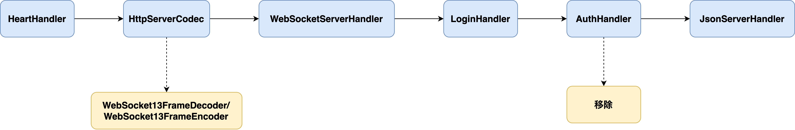
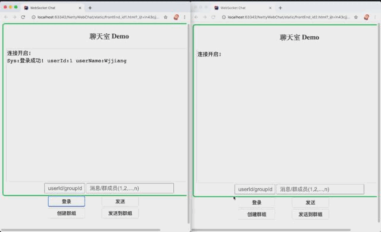

# README

## 1. 说明

本项目**仅**基于 Netty 框架实现了仿微信的后端服务器以及提供了简单的前端聊天室。简单且适合入门学习 Netty。

协议类型为 WebSocket。

## 2. 项目结构说明

- handler 包：放 Netty 中的 ChannelHandler 类；
- server 包：启动类 WebSocketServer，运行此类的 main 方法就能够运行整个项目的后端服务器；
- service 包：用户登录、登出、消息转发、群创建的业务逻辑类；
- session 包：用户登录状态以及用户群组在内存中的保存；
- resources/static：三个基于 HTML/Javascript 写的前端模拟 html 文件，分别有着不同的用户名和用户 ID。

## 3. ChannelHandler 说明

基于 Netty 的热插拔机制，如果从 HTTP 协议升级为 WebSocket 协议成功，并且用户登录成功，那么就会发生上述的 ChannelHandler 替换以及移除。

- **HeartHandler** 负责心跳机制的检测；

- **HttpServerCodec** 用于处理 HTTP 消息的编码和解码器：在项目中其仅为协议升级请求服务一次，之后就会被替换为 WebSocket13FrameDecoder 与 WebSocket13FrameEncoder。13 表示 WebSocket 的版本。它们会负责将 WebSocket 的协议数据包和 WebSocketFrame 实例的相互转换。

- **WebSocketServerHandler** 负责将 WebSocketFrame 实例转换为 String 向后传播；

- **LoginHandler** 完成三件事：

   * 1. 将字符串解析为 JSONObject 实例，如果不符合 JSON 格式，那么就返回用于其发错信息的提示。
   * 2. 如果是登录请求，那么就在这里处理逻辑。
   * 3. 如果是其他类型的请求，那么就向后传播（首先传播向 AuthHandler 其会进行鉴权工作）。

- **AuthHandler** 负责鉴权：一个连接在登录成功后不需要判断是否登录，所以在鉴权成功后会从 pipeline 中删除。

- **JsonServerHandler**：根据 JSON 数据的 type 字段来分别调用不同的业务逻辑。

  > 如果连接数多，可以将业务逻辑交给第三方线程池来完成，本项目暂时没有必要，

## 4. 运行说明

本项目仅仅基于 Netty，所以不需要任何配置可以直接运行；

- 运行方式为：直接运行 WebSocketServer 的 mian 方法，默认监听端口：8000；

- 测试方式为：使用浏览器打开 resources/static 下的三个 html 文件，并点击登录按钮登录；
- html 默认连接的服务器地址为：`ws://localhost:8000`；

测试 Demo：

